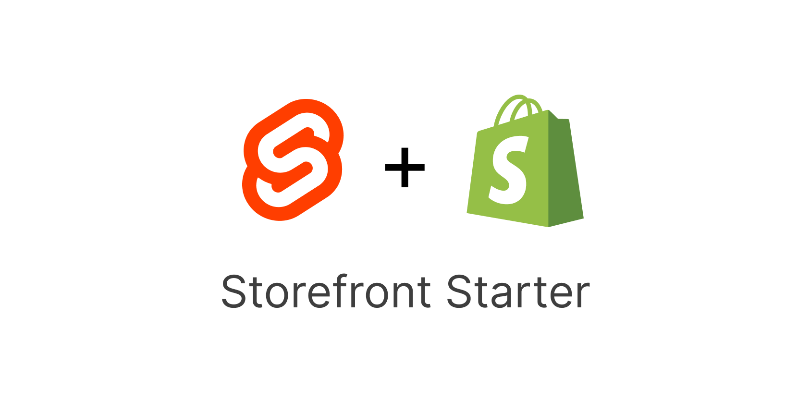

# SvelteKit-Shopify Storefront Starter



[Live preview](https://sveltekit-shopify-storefront-starter.vercel.app/)

This is a template for creating a Storefront with SvelteKit and the [Shopify Storefront API](https://shopify.dev/docs/api/storefront). The template is constantly being improved and the code refactored

Some of the features:
- listing all products in store as product cards
- Product page
- Simple product card pagination
- Adding items to cart
- Checking out a single product seperate from cart

To develop locally:
- Clone the repo
- Run ```npm install```
- Start development server ```npm run dev```

Add the following environment variables:
- ```VITE_SHOPIFY_STOREFRONT_API_TOKEN```: The public access token provided by the Headless app in your Shopify store
- ```VITE_STORE_NAME```: The name of your Shopify store that is before ".myshopify.com" (eg:test-sveltekit-store)


## Deploy
Deploy to Vercel or Netlify:

[](https://app.netlify.com/start/deploy?repository=https://github.com/joe-ashraf01/sveltekit-shopify-storefront-starter)
[](https://vercel.com/new/clone?repository-url=https://github.com/joe-ashraf01/sveltekit-shopify-storefront-starter)
